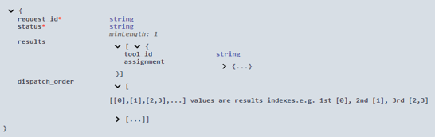
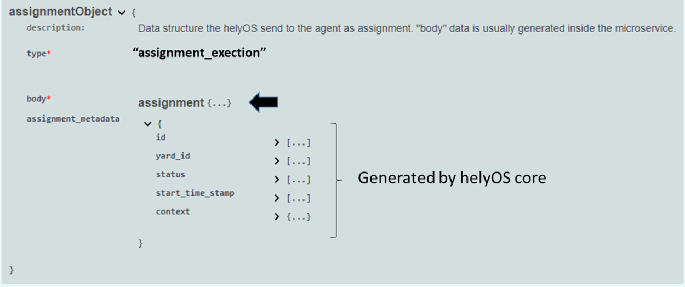
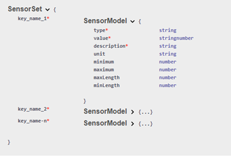

Data Formats 
============

helyOS use JSON formats. Except for a minimum set of required fields used by helyOS to control the data flow, developers can freely choose the data structure of 
the assignment, map and sensor data.  In helyOS framework, most of the data formats used in a project will result from agreements between user interface programmers, 
path planers developers and the vehicle controller developers.

Yard and map formats
--------------------
helyOS is very flexible regarding map data structure. The map information is organized by yards, with each yard containing n **map objects**. Each map object has a JSON data field. 

The map object data can contain any kind of information; from a simple polygon representing an obstacle to a complete Geo-JSON data structure representing a map layer. 
The definition of map objects and the alignment with other entities of a project lies within the responsibility of the developers.

- **helyOS yard**

  - id: database id. Automatically generated.
  - uid: string that identify the yard.
  - name: name of the yard.
  - lat: latitude map origin.
  - lon: longitude map origin.
  - alt: altitude map origin.
  - map_data: (optional) JSON field containing relevant rendering information or metadata.
  - data_format: (optional) name of the map data format. Example: "Trucktrix-Map"

An agent arriving at an automated yard must perform the check-in for that yard. The check-in procedure registers the agent to the helyOS system. 
The agent must provide the uid of the respective yard. helyOS returns the map origin as part of the Check-In-Response.

- **helyOS map object**

  - yard_id: database id of the yard.
  - name: name of the map object.
  - **data**: JSON field (defined by the developer).
  - type: string to identify the object.
  - metadata: (optional) JSON field containing any relevant information.
  - data_format: (optional) name of the map data format. Example: “Trucktrix-Map”

Assignment data format
----------------------
helyOS is agnostic regarding the assignment data format. Nevertheless, the assignment must be enclosed in a JSON structure together with other fields that will help helyOS to route the assignment to the correct agent.

In the helyOS framework, the assignment is originated from a microservice [*]. That is, the developers must create a microservice that produces the assignment data. The  microservice's response must have the following data structure: 

    Data format: microservice response to create assignments.

Note, in the inset, that the assignment is nested into the field *results*.  helyOS core will forward the *assignment* to the agent indicated by *tool_id* . The agent will finally receive this assignment inside the following data structure:

    Data format: RabbitMQ message of assignment as received by the agent.

.. [*] The assignment data can be also created in the frontend if the related mission uses a microservice set as dummy in the helyOS dashboard. A dummy microservice simply reflects back the request data as the response.

Ref: https://app.swaggerhub.com/apis-docs/helyOS/helyos_agent_comm

Agent data format
-----------------
The agent data is saved in the database and can be updated by the helyOS Dashboard, or user interface, or by the own agent via RabbitMQ

- **Agent Fields**

  - uuid: universal unique identifier.
  - available_operations: array of string defining the operations available for the agent.
  - geometry: free JSON format defining the vehicle geometry.
  - factsheet:  JSON field added for compatibility with VDA 5050.
  - x, y, z, orientations : x, y and z a numbers to specify the position of the agent. Orientations is a number array with information of the orientation of the first agent part, and of the joint angles for trailers.
  - status/state: "not_automatable" | "free" | "ready" | "busy" 
  - sensors: JSON field containing any data about the agent: temperature, diagnosis data, assignment progress, velocity etc.  HelyOS-native sensor data format allows the data be visualized in the helyOS dashboard. However, following this specification is optional; the field sensors can hold any arbitrary data structure. The data format is imposed by the visualization app that the developer choose to read it.

helyOS-native Sensor Data Format
--------------------------------
The sensor data returned from agent can have any format.  This information is published in a rabbitMQ topic and helyOS forward this data to user clients via WebSocket. Therefore the user interface must parse the sensor values. 

However, if you wish the sensor values to be visualized also on the helyOS Admin dashboard, then you must use the following format:

    Sensor data format

Mission request data format
---------------------------
To create a mission, the software developers must insert a row in the table of work processes. They can use the GraphQL language or the helyOS Javascript SDK.  
Here again, helyOS does not specify the content of data.

.. code::

    {	
        yardId: number,
        workProcessTypeName: string
        status: string
        toolIds: array of numbers
        waitFreeAgent: boolean
        data: {…}          
    }

The field data will be forwarded to all microservices linked to the mission given by the *workProcessTypeName*.

**The follow fields are processed by helyOS core:**

- **yardId:** Database id of yard.
- **workProcessTypeName:** One of the mission names previously defined in the helyOS dashboard (Define Missions view).
- **status:**  'draft' | "cancelling" |  'canceled' | 'dispatched' | "preparing resources" | "calculating" | "executing" |  "succeeded".  When creating, you can only define as 'draft' or "dispatched".  When updating, you can only set the status as "cancelling" or "dispatched".
- **toolIds:** A list containing only the database ids of the agents taking part in the mission. This agents will be reserved by helyOS core.
- **waitFreeAgent (optional):** Default is true. It defines if helyOS must wait all agents listed in **toolIds** to report the status free before triggering the mission calculations.  Set false if you don't need to reserve the agent and you can pile up assignments in the agent queue. Notice that this may produce assignments calculated with outdated yard data. 

