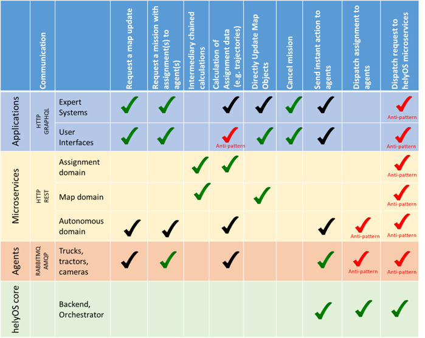

Definitions
===========

Message broker
--------------
Message brokers are intermediary computer program modules in telecommunication or computer networks through which  software applications communicate by exchanging formally defined messages. 

RabbitMQ
--------
It is the helyOS message broker that delivers the assignments to the agents and communicates with the autonomous domain. 

Agent 
-----
A device that receives assignments. E.g., automated vehicles, cameras, traffic lights. . Agents can be moving devices such as automated vehicles, but also stationary objects, providing data such as cameras, traffic lights. Each agent must have a unique identifier code and be connected as a client to RabbitMQ. 

helyOS core
-----------
The main component of the system, enclosing the business logics and the orchestration of  services and assignments to the agents. It can also work as the backend for web applications.  

.. _helyos_assignment: 

Assignment
----------
A task or group of tasks delivered to the agent by the helyOS core via rabbitMQ. The agent must complete the entire assignment without the support of the helyOS core. The agent must report the assignment status as "running", "completed", "aborted" or "failed". helyOS core can of course send a cancel request to the agent for terminating the assignment. 

Mission
-------
A mission consists of a group of one or more assignments, delivered to one single agent or to several agents. It usually originates from the client: The client creates a mission and helyOS uses the microservices to decompose the mission into several assignments. The microservices will also define the order of execution of the assignments. In principle, the client does not create assignments. Rather, the client creates missions and the microservices create assignments. 

Instant Actions
---------------
Identical to the VDA5050 protocol, helyOS core can send instant commands from the user interface to the agents. These commands are independent of any assignment. 

Microservices
-------------
The approach by which functionalities are implemented using small and independent services. Each one of the small services is provided by one independent server, maximizing decoupling and facilitating the development according to specific domains. The word microservices usually refers to "microservice architecture", in this documentation, however, we use the word to define a single-functionality service.

Autonomous domain (also automaton domain) 
-----------------------------------------
Corresponds to the robots, cameras, devices and agents connected to rabbitMQ. When the helyOS core dispatches an assignment to any member of the autonomous domain, it expects this assignment to be resolved inside this domain. helyOS core still can cancel assignments. 
 
Yard
----
A delimited area where agents perform their assignments. It contains map objects. 

Map object
----------
The digital representation of any object or map layer inside the yard (space where the agents move): obstacle, parking areas, road, buildings, docking gates. The data format interpretation of these objects is the responsibility of the microservices and/or front-end.

Agent check in 
--------------
The helyOS framework supports several yards. In real-world applications, the agent  needs to authenticate itself every time it enters or switches the yard. This is done by the agent check-in.

Difference between mission and assignment
-----------------------------------------
A yard automation application is defined in terms of missions. To complete a mission, agents must perform one or more assignments. helyOS receives the request of a mission and dispatches assignments to one or more agents.

What is possible in helyOS framework?
-------------------------------------

