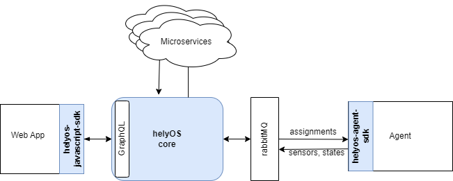

Software Components 
===================

helyOS core
-----------

The helyOS core is a nodeJS software that works as a ready-to-use backend for control tower software in yard automation. It has five responsibilities: 

1. Automated configuration of the rabbitMQ server to be used as message broker for yard automation (requires admin permission).
2. Collection of the yard state (obstacles, map, agent ids and positions, etc.).
3. Provision of an API endpoint for frontend apps for creating missions and accessing the yard state.
4. Orchestration of mission assignments that are sent to the vehicles via rabbitMQ. It is important to stress that the “orchestration” includes the conditional and ordered dispatch of assignments to each agent according to its reported state.
5. Orchestration of microservices used to calculate the assignment data.

Source Code: available upon request.

helyOS JavaScript SDK
---------------------

Web apps interact with helyOS via HTTP protocol using the GraphQL language. To accelerate the development, one can optionally use the helyOS JavaScript SDK, which wraps the GraphQL commands in convenient typescript functions. helyOS JavaScript SDK has the following functionalities:

1. create missions in helyOS core
2. cancel missions in helyOS core
3. send instant action commands to the agents via helyOS core
4. get yard and agent live data 
5. get mission and assignment data
6. all setting commands available in the helyOS dashboard (requires admin permission)

Source Code: https://github.com/FraunhoferIVI/helyOS-javascript-sdk

Documentation: https://fraunhoferivi.github.io/helyOS-javascript-sdk/

helyOS Agent SDK
----------------

Agents (vehicles or robots) are connected to helyOS through rabbitMQ. The connection and communication with helyOS can be implemented using the **helyOS-agent-sdk** python package.

The helyOS-agent-sdk includes the following functionalities:

1. connection to rabbitMQ server
2. registration in helyOS yard (check in)
3. report sensors and agent states to helyOS core.
4. receive assignments and instant action commands from helyOS core
5. communicate with other agents and devices in the same RabbitMQ network

Source Code: https://github.com/FraunhoferIVI/helyOS-agent-sdk

Documentation: https://fraunhoferivi.github.io/helyOS-agent-sdk/build/html/index.html

    helyOS framework