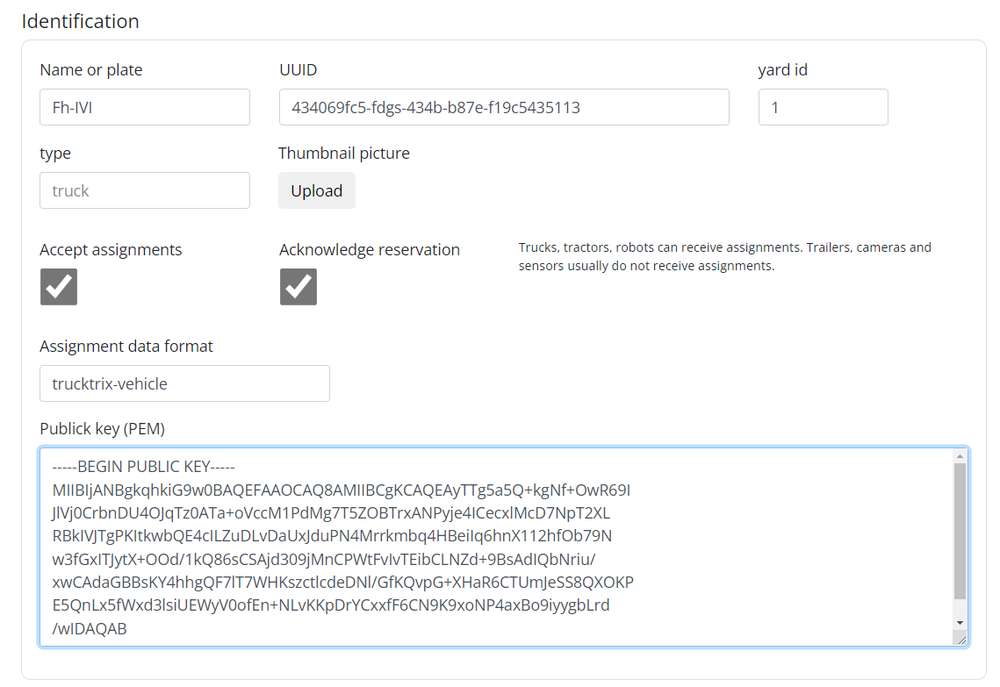
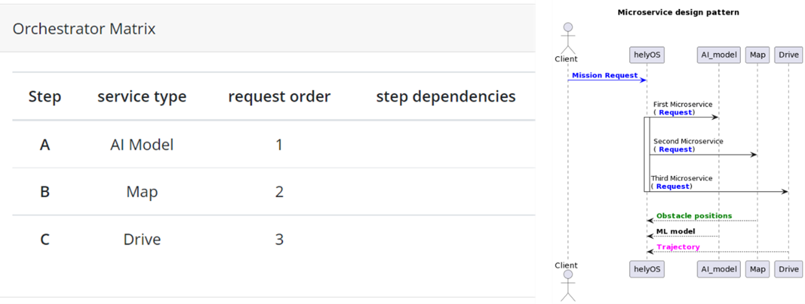

Admin Dashboard 
===============
The helyOS dashboard is a GUI that helps developers to set up helyOS and to debug the application.  The default port to access the dashboard is 8080: http://localhost:8080.

.. note:: 
    In principle, all helyOS configuration can be also done by directly writing the settings tables in the database via GraphQL interface (or SQL scripts); 
    such an approach would be useful for automating the initial configurations for a deployment.

"Yards" View
----------------
In this view, the administrator will register the area where the automated agents (vehicles, robots) are confined, we call it *yard*.  The agents must be connected (checked in) to one yard to perform a mission.

- **uid:** It is the responsibility of the administrator to provide an unique identifier to the yard.  Not to be confused with the database id, which is automatically ascribed.

- **Yard type:** Any descriptive name chosen by the developer to define the characteristics of the yard (e.g farm_yard, parking_lot, port, etc). 

- **Lat, Lon and Alt:** Geographic coordinates of the yard center: latitude, longitude and altitude. (WGS84 reference system)

- **Metadata:** User-defined JSON field containing any metadata relevant for the front-end application, e.g., map zoom level, visible map layers. It is optional.

- **Source:** Each yard has one or several map objects associated with.  The source of the map objects can be a direct data input, a map microservice or a simple SQL initialization script. This field is used to specify the name of this source. It is optional.

"Register Agents" View
--------------------------
In this view, the administrator will register the agents (vehicles, robots) and check their status. **Remember that this can also be done by any software or script via graphQL.** 

    Register agents view

- **uuid:** It is the responsibility of the administrator to provide a unique uuid to the agent. 

- **Name or plate:** Some friendly name to identify the agent. 

- **Type:** Type of the agent: tractor, car, truck, etc.

- **Public key:** RSA public key, the correspondent private key will be saved in the agent. It is used to send encrypted messages to the agent.

- **accept assignments:** This field specifies wheather the agent can receive assignments.

.. note:: 
    ATTENTION: Once the agent is connected to helyOS, the next fields may be constantly updated, overwriting any information that you input in the form.

- **Position:**  Fields related to the position of the agent. 

  - yard_id : The current yard that the agent is checked into.
  - x and y:  Spatial coordinates of the agent: x and y.
  - orientation:   Angle defining agent orientation.
  - orientations:  In case of multi-part vehicles, one can use an array of angles: [1,0.2, …] 

- **Connection and status:**  Connection and work process status.
- **Geometry:** User-defined JSON field to specify the agent geometry information. This field can be overwritten by the agent at any time.

Other Options for Registering Agents
^^^^^^^^^^^^^^^^^^^^^^^^^^^^^^^^^^^^
Public key folder
    One option to register agents is simply adding their public keys in the folder */agent-pubkeys/* using the following convention for file name: *{uuid}.key*. 
    The agent uuid and public key will be saved in the helyOS database, this is already enough to perform the check in. Other fields can be manually or automatically 
    updated later after the check in.

Agent auto-registration
    An agent is also able to register itself in the check-in procedure. For this, the agent should send the auto-registration token in the check-in message. 
    The auto registration token is configured in helyOS core by using the environment variable AGENT_AUTO_REGISTER_TOKEN. 

The "Define Missions" View
--------------------------
In this view, the developer will define the missions available for the software application. A mission represents a single task or a group of tasks. These tasks can be related to the calculation of a path, the storing of data, handling of map information, or a combination of all of above. 

.. note:: 
    Each registered mission can be seen as a new feature in the final application.

    Define missions view

- **Name:** Name of the mission, that will be later used by the *Client* to trigger this kind of mission. E.g. "park_car", "seed_field", "drive_from_A_to_B".

- **Description:** Text documenting the mission goals and the used microservices. 

- **Maximum agents:** Indicates the maximum number of agents handled by this mission.

- **Settings:** User-defined JSON field where the developer can pass fixed parameters to the user application or to all microservices used in this mission. It appends the field "_settings" in the MissionRequest.    

The missions trigger one or more microservices. The sequential order of microservices is defined in the Mission Recipes view. That is, the Mission Recipes teach helyOS how to **orchestrate** the microservices to implement the desired mission. 

"Microservices" View
------------------------
In this view, the developer registers the microservices employed in the missions. Each microservice must belong to one of the three available domains:

Assignment domain: 
    microservice responses are interpreted as assignment to an agent.

Map domain:
    microservice responses are interpreted as updates for the map objects.

Storage domain: 
    microservice does not respond with relevant data, the request is only used to push data to an external storage server and return the request status (2XX or 4XX).

    Microservices view

When registering the microservice the following information is required:

- **Name:** Identify the microservice
- **URL:** Complete URL address, including http or https prefix and the port suffix.
- **Domain:** Choose between *Assignment*, *Map* or *Storage* domain.
- **API key:** Token used to authenticate the request call. It will be added to the request headers under the key *Authorization*.
- **Enable/Disable button:** Enables/disables a microservice.
- **Type:**  Any word chosen by the developer to define a class of functionality for the microservice (e.g field_planner, driving_planner). This word is important because it will be used later to define a mission. Many microservices can have the same Type, but only one of them can be enabled at a given time.
- **Process time limit:** Maximum amount of time the system will wait for the microservice result. Not to be confused with the HTTP request timeout, used in the long poll approach. helyOS uses periodic polls spaced by 5 to 10 seconds to get the microservice results.
- **Config:** User-defined JSON field where the developer can pass fixed parameters on to the microservice

.. code:: 

    {
        request*   MissionData
        config       {...}
        context*    HelyOSContext
    }

Request body sent to microservices. *request* is defined by the software developer according to the application. config is set in the dashboard and context contains the 
yard state and the response of the previous chained  microservice. The yard state contains all the map object and agent ids and positions at the moment of the service request.

The Dummy Service 
^^^^^^^^^^^^^^^^^
When a microservice is marked as dummy, helyOS will not send requests to any URL. Instead, helyOS will just copy the mission request data to the result field of the microservice. 
This is useful in the scenario where the application does not need to perform any calculation in microservices, e.g., if pre-defined assignment or map updates are already 
stored in the client.  For example, if the dummy service was registered in the assignment domain, the *Client* can directly send the assignment data to the agent. 
If it was registered in the *Map* domain, the request data will be directly used to update the map objects.

.. _mission-recipes-view:

"Missions Recipes" View
---------------------------
In this view the developer will decompose the previously registered mission into microservice calls. This is done by adding rows to the "Service Matrix" (click Add button). 
Each row corresponds to a step in the mission process and is used to orchestrate the microservice calls.

    Mission recipes view 

- **Step:** Give a name to your step, using a single word or a letter. Each step within a recipe must be unique.

- **Service Type:** It defines which microservice will be used in the step. The step will call the enabled microservice of the given "Type".  The "Type" is defined when the microservices are registered. Note that only one microservice of a given "Type" is enabled.

- **Service Response:** If the microservice called in the step will produce an intermediate result in a chain of microservice calls, the option "intermediate step" should be marked. If the microservice response contains assignment or the map update data ready to be executed, the option "apply step result" should be marked.

- **Request Order:** : The order in which the requests will be dispatched. Note that the microservice responses can return in any order, since the services are asynchronous. If you want to ensure that the order of the microservices responses reflects the order of request dispatches, you must set the “Step Dependencies”.

- **Step Dependences:**  Define dependencies on other steps (microservices).  For instance, if step “C” depends on step “A” and “B”, the microservice associated with step “C” will be executed only after the responses of steps “A” and “B” are received. The responses of steps “A” and “B” will be automatically appended in the context of the step “C” request.

    **Example 1.** No dependencies between steps: All the microservices respond asynchronously.

    **Example 2.** Dependencies between steps: Microservices are called and respond sequentially.

