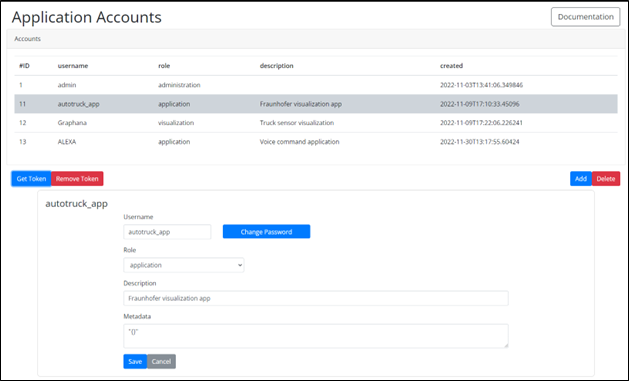

Application accounts
====================

There are three types of helyOS accounts: the *admin*, *application*, and *visualization* account. They are authenticated by token authentication.

Each account type is ascribed to a specific database role in Postgres. Therefore, the permission set will be controlled by on the database level. The *admin* accounts will have permission to read and write all tables and execute all DB procedure functions. The *application* accounts will be able to read all the tables but write only on a few of them. The *visualization* accounts can only read tables.

Further tuning of permissions or creation of new account types must be defined by an outer software layer for a specific software application.

    Application accounts view