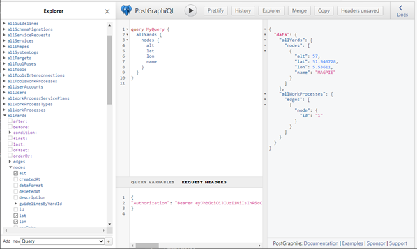

Communication
=============
The communication between helyOS and user apps uses the GraphQL language. GraphQL is designed to make database APIs flexible and developer friendly. As an alternative to REST, GraphQL lets developers construct requests that pull and change data from multiple tables. GraphQL is the default language to interact with helyOS-based applications and to access the yard state. 

GraphQL queries and mutations can be tested using the GraphiQL developer interface: 

http://localhost:5000/graphiql

    GraphiQL view

For example, a GraphQL request to create a mission in plain python would be written as:

.. code:: python

    import requests

    # Login: request to the Authorization token should come here
    ...
    #
            
    url = "http://helyo_server:5000/graphql"
    headers = {"Content-Type": "application/json; charset=utf-8",
            "Authorization":"Bearer eyJhbGciOiJI… "}
            
    body_data = { 

    "operationName": "createWorkProcess",

    "query": """mutation createWorkProcess($postMessage: CreateWorkProcessInput!)
                {
                    createWorkProcess(input: $postMessage) {
                        workProcess {id, status }
                    }
                }
            """,

    "variables": {"postMessage" : {"clientMutationId": "not_used",
                                        "workProcess": {
                                            "status": "draft",
                                            "workProcessTypeName": "driving",
                            "data": "{}",
                                            "agentIds": [1]		
                                        }
                                }  
                    }
    }
            
    response = requests.post(url, headers=headers, json=body_data)

Using GraphQL python libraries, this can be written more concisely. By using our helyOS- Javascript SDK  `helyOS-javascript-sdk <https://github.com/FraunhoferIVI/helyOS-javascript-sdk>`, the above code becomes:

.. code:: JavaScript

    import { HelyosServices } from 'helyosjs-sdk';
    const helyosService = new HelyosServices('http://localhost', {socketPort:'5002',
                                                                gqlPort:'5000'});
    const createNewMission = () =>  helyosService.workProcess.create({
                                status: 'draft',            
                                workProcessTypeName: 'driving',
                                agentIds: [1],    
                                data: {},
                            });

    helyosService.login("username", "password")
    .then( response => helyosService.connect())
    .then( connected =>  createNewMission());

A more advanced example with position tracking:

.. code:: JavaScript

    import { HelyosServices } from 'helyosjs-sdk';

    const helyosService = new HelyosServices('http://localhost', 
                                            {socketPort:'5002', gqlPort:'5000'});

    function createNewMission() {
        console.log("==> Creating drive mission...");
        const trucktrixPathPlannerRequest = {   x:-24945.117347564425, 
                                                y:12894.566793421798,
                                                anchor:"front",
                                                orientation:1507.1, 
                                                orientations:[1507.1],
                                                tool_id:1,
                                                _settings:{},
                                            };

    return helyosService.workProcess.create({
                                agentIds: [1],    
                                yardId: 1,       
                                workProcessTypeName: 'driving',  
                                data: trucktrixPathPlannerRequest as any, 
                                status: 'dispatched',// status = 'draft' will save the mission 
                                                    // but no dispatch it.
        });
    }

    function trackVehicle() {
    console.log("==> Tracking agent position and assignment status...\n");

    helyosService.socket.on('new_agent_poses',(updates: any)=>{
    const agentData = updates.filter(( agent:any) => agent.agentId === 1);
        console.log(agentData);
    });

    helyosService.socket.on('change_work_processes',(updates:any)=>{
    const wprocessStatus = updates.map((wprocess:any) => wprocess.status);
        console.log(wprocessStatus);
        if (wprocessStatus.includes('succeeded') || wprocessStatus.includes('failed') ) {
            process.exit();
        }
    });

    }

    helyosService.login("username", "password")
    .then( response => helyosService.connect())
    .then( connected => {
        console.log("==> Connected to helyOS")
        createNewMission()
        .then(() => trackVehicle())
    });
