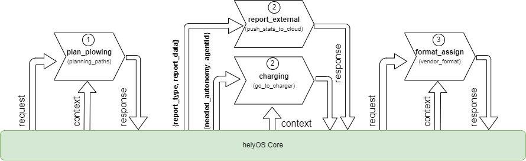

Missions Request: from App to helyOS core
-----------------------------------------
      
  In order to initiate a mission, the applications are required to add a new entry into the work processes table
  of helyOS Postgres database. 
  This can be accomplished using either the GraphQL language or its Javascript wrapper, `helyosjs-sdk`.
  The following example shows how to create a mission using the Javascript SDK.

      
  .. code-block:: typescript
      :caption: Example of mission creation using the Javascript SDK. The mission type is “driving” and it employs the agent with id=1.

      import { HelyosServices } from 'helyosjs-sdk';
      import { token } from './token';

      const backendUrl = 'http://localhost';
      const socketPort = 5002;
      const gqlPort = 5000;

      const main = async () => {
          const hellosService = new HelyosServices(backendUrl, {socketPort, gqlPort});
          hellosService.token = token;
          await hellosService.connect()
          hellosService.workProcess.create({
                              yardId: 1,
                              workProcessTypeName: 'driving',
                              status: 'dispatched',
                              agentIds: [1],
                              waitFreeAgent: true,
                              data: { ... } // user-defined JSON field
                                  
                          });
      }

      main();
  
      

      
  Once the workProcess (mission) is created, the following fields are processed by helyOS core:
      
      - **yardId:** Database id of yard.
      - **workProcessTypeName:** One of the mission names previously defined in the helyOS dashboard (Missions Receipe view).
      - **status:**  'draft' | "cancelling" |  'canceled' |  "dispatched" | "preparing resources" | "calculating" | "executing" |  "succeeded". When creating, you can only define as 'draft' or "dispatched". Once the status is set as 'dispatched', the helyOS will prompt the execution of the mission.  When updating, you can only set the status as "cancelling" or "dispatched".
      - **agentIds:** A list containing only the database ids of the agents taking part in the mission. This agents will be reserved by helyOS core.
     
      
  The following field is not processed by helyOS core, and it is forwarded to the microservice(s):
      
      - **data:** The mission data, a user-defined JSON  field which is specific to the application. This field will be forwarded to the microservices. The microservice will receive the mission data from the client software along with the yard state from helyOS core (helyOSContext). The developer must therefore add here any necessary information that is not present in the yard state. For example, pointing out the agent Id that will receive the assignment, or the ordering that the assignment must be executed.  
      

  The following field is optional:

      - **waitFreeAgent (optional):** Default is true. It defines whether helyOS must wait for all agents listed in agentIds to report their status as “free” before triggering the mission calculations. Set false if you don’t need to reserve the agent and you can pile up assignments in the agent queue. Notice that this may produce assignments calculated with outdated yard context data. 
      

Service Requests: from helyOS to Microservices
----------------------------------------------
        
  Once the mission is triggered, helyOS will dispatch HTTP POST requests to the related microservices;
  one mission can trigger the request of one or many microservices. 
  The order in which the microservices are called is pre-configured as mission steps using the mission recipe editor in the :ref:`helyOS dashboard <mission-recipes-view>`;
  **each step is associated to one microservice call.** 

  All these requests contain the field **request** with the mission data, and the field **context** with the yard, agents and mission-related data.
  As default, the **request** field contains the user-defined **workProcess.data**.

  .. code-block:: typescript
      :caption: Requesta data send from helyOS to the microservice.

      HelyOSRequest  {
          request: any;  // mission input data from the application

          context: HelyOSContext;

          config?: any;  // optional configuration data defined in the helyOS dashboard.
          
      }

      
  The **context** contains all information relevant at the moment of the dispatch, including mission orchestation data, yard data and calculation results from previous steps from other microservices in  **context.dependencies**.

  .. code-block:: typescript
      :caption: Context data autommatically generated by helyOS and sent to the microservice.

      HelyOSContext  {

          agents: AgentModel[]; // arrray of agents relevant to the mission.

          map: {
                      id: number, 
                      origin: { lat: number, long: number}
                      map_objects : MapObjectsModel[]; // array of all map objects in the yard.
          };

          orchestation: {
                      current_step: string, // name of the current step in the mission.
                      next_step: string[],  // names of the subsequent steps in the mission.
          };

          dependencies: { 
                      step: string, 
                      requestUid: string, 
                      response: any 
          }[]; // array of data responses from microservice of previous steps.
                        
      }

The `AgentModel` and `MapObjectsModel` are defined here:
:ref:`models_description`.

Service Response: from Microservices to helyOS
----------------------------------------------
      
  In general the microservice response is a JSON object with the following structure:

  .. code-block:: typescript
      :caption: Response data structure as defined in the Assignment planner API.

      HelyOSMicroserviceResponse {
          request_id?: string;  // generated job id. Can be used to poll results from long running jobs.

          status: "failed" | "pending" | "successful";  .

          results: AssignmentPlan[] | MapUpdate | any;

          dispatch_order?: number[][]; 

          orchestration?: {
                    nex_step_request: [step: string]: any; // input data to be sent to the next microservice(s).
                    }
      }

  - **request_id:** Service generated job id.

  - **status** can be "failed" | "pending" | "successful". While "pending" is returned, helyOS will poll the microservice for results using the request_id.

  - **results** can be an array of assignments or a map update, depending on the domain where the microservice was registered. If the microservice is perform intermediate calculations, the results can be any other data structure.
  
  - **dispatch_order** is an array of the element indexes of the results array. In case of Assignment planners, the order of the indexes defines the order in which the corresponding assignment in the results array will be dispatched to the agent.

  - **orchestration (optional)**  is a field designed to transmit data to the subsequent step in the mission. It is utilized when the input data for the following microservice (the field **request**) needs to be different from the initial mission input data (the field **workProcess.data**).
  
  

  Example of orchestration field.
  

  Supose that a mission is composed of three steps: 1:"plan_plowing",  2:("charging" and "report_external") and 3:"driving". 

  .. figure:: ./img/orchestration.png
    :align: center
    :width: 600

  
  The microservice of the first step will calculate the path and use the orchestation field to request the charging microservice to supply enough energy for the vehicle run the entire path length.

  .. code-block:: typescript
    :caption: Example of response using the orchestration field.

      {
        request_id: "1234",
        status: "successful",
        results:  [
          {
            agent_id: 23,
            assignment: {...}
          }
        ],

        orchestration:  {
          nex_step_request: {
            "charging": {
                agent_id: 23,
                needed_autonomy: "500 m"
            },
            "report_external": {
                report_type: "charge_report",
                report_data: {...}
            }
          }
        }
      }
      
The microservices of the next step in the mission will receive the following input data in their request field:

- For the "charging" microservice: `request = {agent_id: 23,  needed_autonomy: "500 m"}`
- For the "report_external" microservice: `request = { "report_type": "charge_report", report_data: {...}}`

        
.. raw:: html

    
    

Assignment Creation
^^^^^^^^^^^^^^^^^^^
Assignments are created by microservices in the *Assignment Planner* domain. A microservice can create one or more assignments per mission, and can define the dispatch order to agents.

  .. code-block:: typescript
      :caption: Response data to create agent assignments.

      HelyOSMicroserviceResponse {

          request_id?: string;  // generated job id. Can be used to poll results from long running jobs.

          status: "failed" | "pending" | "successful";  .

          results: AssignmentPlan[]; // array of assignments.

          dispatch_order?: number[][]; // order in which the assignments will be dispatched to the agents.

          orchestration?: {
                    nex_step_request: [step: string]: any; 
                    }
      }

      AssignmentPlan {
          agent_id?: number; // id of the agent that will receive the assignment.
          agent_uuid?: string; // UUID of the agent that will receive the assignment.
          assignment: any; // assignment data, usually defined by the agent vendor.
      }

This microservice response data structure, as defined before, will contains the assignment data in the **results** field.

- **results:** it is an array of assignments where each assignment is ascribed to a agent id. 
- **dispatch_order:**  When assignments must be executed sequentially, this variable is defined as an array of the element indexes of the results array. The order of the indexes defines the order in which the corresponding assignment will be dispatched to the agent. E.g., [[0], [1,2], [3,4,5]] means that the first assignment will be dispatched first, then the second and third assignments will be dispatched simultaneously, and finally the fourth, fifth and sixth assignments will be dispatched simultaneously.

In the AssignmentPlan, the **assignment** field is a user-defined JSON field that contains the data necessary for the agent to execute the assignment.
The agent that will receive the assignment must be identified either by the **agent_id** or by the **agent_uuid** field. The **agent_id** is the database id of the agent, and the **agent_uuid** is the UUID of the agent. 

.. note:: 
  | Note: You cannot send more than one mission at once to a same agent. However, you can SEND SEVERAL ASSIGNMENTS to a same agent! For this, add the assignments into the **results** array with the same **agent_id**.
  
  | Use the **dispatch_order** field to let helyOS to sequentially dispatch the assignments to a same agent. Otherwise the assignments will be sent simultaneously; in this case, the agent would need to be smart enough to consume and handle the assignments in the correct order.

Mission Sequence
^^^^^^^^^^^^^^^^
The following figure illustrates the mission request process from the point of view of the Client application.  

1. The client logs on to helyOS and receives an authentication token, which will be used for subsequent requests.
2. The client makes the mission request and helyOS core reserves all agents necessary for that mission. 
3. helyOS calls the microservices to calculate the assignment data for the requested mission (which microservices are called and the order in which they are called is pre-configured for each mission type).
4. helyOS receives the assignment data from the microservices and distributes them to the agents using RabbitMQ.
5. When the agents have finished their assignment, they inform helyOS. helyOS may release the agent (reserved = False).

.. figure:: ./img/mission_creation.png
  :align: center
  :width: 600

  The process of mission creation from client

      
      
      
      
      
      
      
      
      
      
      

