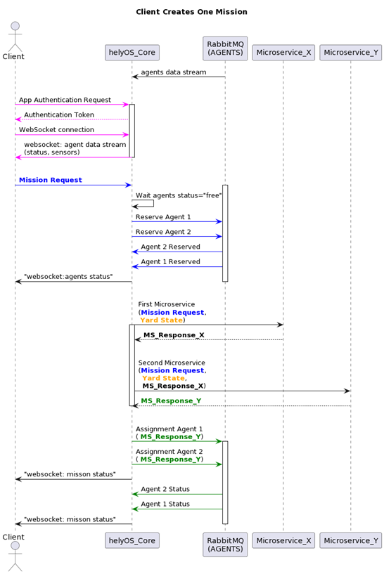

Request of Missions from App to helyOS 
--------------------------------------
Mission Request
^^^^^^^^^^^^^^^
To create a mission, the software developers must insert a row in the table of work processes. They can use either the GraphQL language or helyOS Javascript SDK for that purpose.

.. code::

    {	yardId: 1,
        workProcessTypeName: 'driving',
        status: 'dispatched',
        toolIds: [1],
        waitFreeAgent: true,
        data: {
            "x":-25507.5521640504,"y":20096.963720561474,
            "anchor":"front","tool_id":1,"orientation":918,
            "schedStartAt":"2021-11-01T15:09:49.802Z",
        }
    }

Example of mission: The mission type is “driving” and it employs the agent (tool) with id=1.

- **The following fields are processed by helyOS core:**

  - **yardId:** Database id of yard.
  - **workProcessTypeName:** One of the mission names previously defined in the helyOS dashboard (Define Missions view).
  - **status:**  'draft' | "cancelling" |  'canceled' |  "dispatched" | "preparing resources" | "calculating" | "executing" |  "succeeded". When creating, you can only define as 'draft' or "dispatched". Once the status is set as 'dispatched', the helyOS will prompt the execution of the mission.  When updating, you can only set the status as "cancelling" or "dispatched".  - **toolIds:** A list containing only the database ids of the agents taking part in the mission. This agents will be reserved by helyOS core.
  - **waitFreeAgent (optional):** Default is true. It defines whether helyOS must wait for all agents listed in toolIds to report their status as “free” before triggering the mission calculations. Set false if you don’t need to reserve the agent and you can pile up assignments in the agent queue. Notice that this may produce assignments calculated with outdated yard data. 

- **The following field is saved by helyOS core and just forwarded to the microservice(s).**

  - **data:** The mission data, a user-defined JSON  field which is specific to the application. This field will be forwarded to the microservices. The microservice will receive the mission data from the client software along with the yard state from helyOS core (helyOSContext). The developer must therefore add here any necessary information that is not present in the yard state. For example, pointing out the agent Id that will receive the assignment, or the ordering that the assignment must be executed.  

Request of Assignments from helyOS to Microservices
---------------------------------------------------
Once the mission is triggered, helyOS will dispatch HTTP requests to the related microservices. These requests contain the mission data from the app, as defined previously, and the context. 

  Context example

The **context** contains all the yard information relevant at the moment of the dispatch, and calculation results from previous steps from other microservices in  **context.dependencies**.

  helyOSContext example

Assignment Creation
^^^^^^^^^^^^^^^^^^^
Assignments are created by microservices in the *Assignment Planner* domain. A microservice can create one or more assignments per mission, and can define the dispatch order to agents.

  Assignment example

Microservice response data structure as defined in the Assignment planner API.

- **request_id:** Service generated job id.
- **status:** "failed" | "pending" | "successful".
- **results:** it is an array of assignments where each assignment is ascribed to a tool id (agent). 
- **dispatch_order:** When assignment must be executed sequentially, this variable is defined as an array of the element indexes of the results array. The order of the indexes defines the order in which the corresponding assignment will be dispatched to the agent.

.. note:: 
  | Note: You cannot send more than one mission at once to a same agent. However, you can SEND SEVERAL ASSIGNMENTS to a same agent! For this, add the assignments as **results** items with the same **toold_id**.
  
  | Use the **dispatch_order** field to let helyOS to sequentially dispatch the assignments to a same agent. Otherwise the assignments will be sent simultaneously; in this case, the agent would need to be smart enough to consume and handle the assignments in the correct order.

Mission Sequence
^^^^^^^^^^^^^^^^
The following figure illustrates the mission request process from the point of view of the Client application.  

1. The client logs on to helyOS and receives an authentication token, which will be used for subsequent requests.
2. The client makes the mission request and helyOS core reserves all agents necessary for that mission. 
3. helyOS calls the microservices to calculate the assignment data for the requested mission (which microservices are called and the order in which they are called is pre-configured for each mission type).
4. helyOS receives the assignment data from the microservices and distributes them to the agents using RabbitMQ.
5. When the agents have finished their assignment, they inform helyOS. helyOS may release the agent (reserved = False).

  The process of mission creation from client

