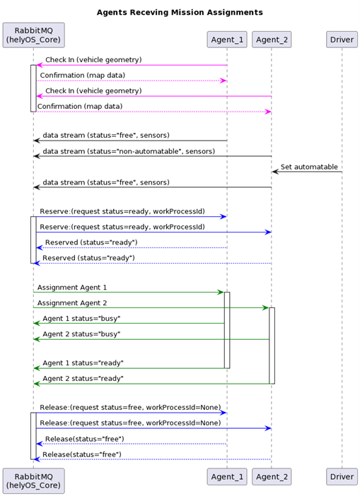

Exchange, Routing-keys and Queues in RabbitMQ
---------------------------------------------

.. figure:: ./img/helyOS_rabbitMQ.png
    :align: center
    :width: 600

    helyOS and rabbitMQ

Thanks to the RabbitMQ routing features, any RabbitMQ client subscribing to the topic exchange *agent_ul* can get the messages filtered by  routing-keys. 

The agents will address their messages to the following routing-keys: 

- **agent.{uuid}.checkin** : used only for check-in data.
- **agent.{uuid}.update** : messages related to updates of agent properties. e.g., vehicle name, geometry data.
- **agent.{uuid}.visualization** : messages reporting the positioning and sensor data. 
- **agent.{uuid}.state** : messages reporting the assignment status and agent state.
- **agent.{uuid}.mission_req** : messages to request missions from helyOS.
- **agent.{uuid}.factsheet** : (included for compatibility with VDA5050) messages to report geometry.

The agents will receive messages from the following routing-keys: 

- **agent.{uuid}.assignment** or **agent.{uuid}.order**: receive assignments.
- **agent.{uuid}.instantActions** : receive instant action commands from helyOS core or any other RabbitMQ client.

Routing-keys can be converted to topics for MQTT clients. Check the table below.

All messages exchanged between helyOS and the agents include the following common fields:

- **type:** string, ex: "checkin", "assignment", "cancel", etc..
- **uuid:** string, the identification of the agent the message is about.
- **body:** JSON object.

The additional field **metadata** is present for some messages.

The **body** field will be specific for each message type. The easiest way to communicate to helyOS is to use the agent SDK connector methods: *publish_general_updates*, *publish_states* and *publish_sensors*.

.. figure:: ./img/rabbitmq_topics_explained_2.png
    :align: center
    :width: 800

Ref: 
`Documentation <https://fraunhoferivi.github.io/helyOS-agent-sdk/build/html/apidocs/helyos_agent_sdk.connector.html#module-helyos_agent_sdk.connector>`_ and `Examples <https://fraunhoferivi.github.io/helyOS-agent-sdk/build/html/examples/index.html>`_

|

Code Examples
-------------

You can connect an agent to helyOS via any RabbitMQ or MQTT client using Python, Java, .Net, Ruby, JavaScript, Go, C and C++.
Here, we bring some examples of connection using Pyhton clients.

**AMQP**

.. code:: python

    import pika
    from my_agent import sensor_json_str, properties_json_str, states_json_str, mission_request_json_str
    from my_callbacks import ia_callback, as_callback

    # connect to RabbitMQ
    hostname ='rabbitmq.server.de'
    username = "134069fc5-fdgs-434b-b87e-f19c5435113"
    UPLINK = "xchange_helyos.agents.ul"; DOWNLINK = "xchange_helyos.agents.dl";

    credentials = pika.PlainCredentials(username, 'secret_passwd')
    sender_validation = pika.BasicProperties(user_id = username)
    parameters = pika.ConnectionParameters(hostname,  5672,credentials=credentials)
    connection = pika.BlockingConnection(parameters)
    channel = connection.channel()

    # publish sensors and position - can be performed up to 1000 Hz
    channel.basic_publish(UPLINK,"agent.134069fc5-fdgs-434b-b87e-f19c5435113.visualization", sensor_json_str, sender_validation)

    # update propeties as geometry and position - can be performed up to 10 Hz
    channel.basic_publish(UPLINK,"agent.134069fc5-fdgs-434b-b87e-f19c5435113.update", properties_json_str, sender_validation)

    # update agent and assignment status - must be performed immediately when the status change. Up to 2 Hz
    channel.basic_publish(UPLINK,"agent.134069fc5-fdgs-434b-b87e-f19c5435113.state", states_json_str ,sender_validation)

    # request a mission to helyOS
    channel.basic_publish(UPLINK,"agent.134069fc5-fdgs-434b-b87e-f19c5435113.mission", mission_request_json_str ,sender_validation)

    # receive instant actions
    channel.queue_declare(queue='ia_queue')        
    channel.queue_bind('ia_queue', DOWNLINK,"agent.134069fc5-fdgs-434b-b87e-f19c5435113.instantActions")
    channel.basic_consume('ia_queue', auto_ack=True, on_message_callback=ia_callback) 
        
    # receive order or assignments
    channel.queue_declare(queue='as_queue')        
    channel.queue_bind('as_queue', DOWNLINK, "agent.134069fc5-fdgs-434b-b87e-f19c5435113.assignment") # or ... .order
    channel.basic_consume('as_queue', auto_ack=True, on_message_callback=as_callback)   

    channel.start_consuming()

Tapping into the agent's data stream

.. code:: python

    import pika, json

    # connect to RabbitMQ
    hostname ='rabbitmq.server.de'
    username = "assistant-3432-434b-b87e-ds3245323"
    UPLINK = "xchange_helyos.agents.ul"

    credentials = pika.PlainCredentials(username, 'secret_passwd')
    parameters = pika.ConnectionParameters(hostname,  5672,credentials=credentials)
    connection = pika.BlockingConnection(parameters)
    channel = connection.channel()

    def parse_any_helyos_agent_message(raw_str):
        # get message string
        object = json.loads(raw_str)
        message_str = object['message']
        message_signature = object['signature'] 
        # parse message string
        message = json.loads(message_str)
        print(f"message type: {message['type']}")
        print(f"message uuid: {message['uuid']}")
        print(f"message body: {message['body']}")
        print(f"message metadata: {message.get('metadata', None)}")

    # Tapping into the agent's data stream - VISUALIZATION
    def tap_visualization_callback(ch, method, properties, raw_str):
        print("visualization data received")
        parse_any_helyos_agent_message(raw_str)

    channel.queue_declare(queue='visualization_queue')
    channel.queue_bind('visualization_queue', UPLINK, "agent.*.visualization")
    channel.basic_consume('visualization_queue', auto_ack=True, on_message_callback=tap_visualization_callback)

    # Tapping into the agent's data stream - STATE
    def tap_state_callback(ch, method, properties, raw_str):
        print("state data received")
        parse_any_helyos_agent_message(raw_str)

    channel.queue_declare(queue='state_queue')
    channel.queue_bind('state_queue', UPLINK, "agent.*.state")
    channel.basic_consume('state_queue', auto_ack=True, on_message_callback=tap_state_callback)

    # Tapping into the agent's data stream - UPDATE
    def tap_update_callback(ch, method, properties, raw_str):
        print("update data received")
        parse_any_helyos_agent_message(raw_str)
    
    channel.queue_declare(queue='update_queue')
    channel.queue_bind('update_queue', UPLINK, "agent.*.update")
    channel.basic_consume('update_queue', auto_ack=True, on_message_callback=tap_update_callback)

    channel.start_consuming()

**MQTT**

.. code:: python

    import paho.mqtt.client as mqtt
    # connect to RabbitMQ
    hostname ='rabbitmq.server.de'
    username = "134069fc5-fdgs-434b-b87e-f19c5435113"

    client = mqtt.Client()
    client.username_pw_set(username, 'secret_passwd')
    client.connect(rabbitmq_host, 1886)

    # publish sensors and position - can be performed up to 1000 Hz
    client.publish("agent/134069fc5-fdgs-434b-b87e-f19c5435113/visualization", sensor_json)

    # update propeties as geometry and position - can be performed up to 10 Hz
    client.publish("agent/134069fc5-fdgs-434b-b87e-f19c5435113/update", propeties_json)

    # update agent and assignment status - must be performed immediately when the status change. Up to 2 Hz
    client.publish("agent/134069fc5-fdgs-434b-b87e-f19c5435113/state", agent_assign_states_json)

    # receive instant actions
    client.subscribe("agent/134069fc5-fdgs-434b-b87e-f19c5435113/instantActions")
    client.message_callback_add("agent/134069fc5-fdgs-434b-b87e-f19c5435113/instantActions",ia_callback) 
        
    # receive order or assignments
    client.subscribe("agent/134069fc5-fdgs-434b-b87e-f19c5435113/assignment") # or ../order
    client.message_callback_add("agent/134069fc5-fdgs-434b-b87e-f19c5435113/assignment",as_callback) 

    client.loop_start()

These codes can be simplified by using the `helyos-agent-sdk`.
See examples also for AMQP and MQTT agents: https://fraunhoferivi.github.io/helyOS-agent-sdk/build/html/examples/index.html

|

Check in agent in helyOS
------------------------
To receive assignments from helyOS, the agent must perform a procedure called "check-in".

In the check-in procedure, the agent will 

- Connect to RabbitMQ and send its identification data.
- If the agent is connected as anonymous and possess the helyOS registration token, a new username and password will be automatically created.
- Create a temporary queue to receive the check-in response.

.. code-block:: typescript
    :caption: Check-in data sent by the agent to helyOS core. The symbol (?) means optional.

    CheckinCommandMessage {
        type: "checkin";

        uuid: string;

        body: {  
                yard_uid: string;         // yard the agent is checking in.
                status: string;
                pose: { x:number, y:number, z:number, orientations:number[]};
                type?: string;
                name?: string;
                data_format?: string;
                public_key?: string;
                geometry?: AnyDataFormat;
                factsheet?: AnyDataFormat
        }

    }

- **geometry:** JSON informing the physical geometry data of the vehicle.
- **yard_uid:** Unique identifier of the yard as registered in the dashboard.

helyOS will respond with the following data:

.. code-block:: typescript
    :caption: Check-in data sent by helyOS core to agent. The symbol (?) means optional.

    CheckinResponseMessage {
        type: "checkin";

        uuid: string;

        body: {  
                agentId: number;     // agent database id number
                yard_uid: string;   // yard the agent is checking in.
                status: string;
                map: {  uid:string, 
                        origin:{lat:number, lon:number, alt:number},
                        map_objects: MapObjects[]
                      };
                rbmq_username: string;
                response_code: string;
                helyos_public_key: string;
                ca_certificate: string;   // RabbitMQ server certificate for SSL connection
                rbmq_password?: string;  // When agent account does not exist in the RabbitMQ server.  
                password_encrypted? boolean              
        }

    }

- **type** = "check in".
- **map:** JSON with the map information from yard.
- **rbmq_username:** RabbitMQ account to be used by this agent.
- **rbmq_password:** RabbitMQ password, only used for anonymous check-in.
- **password_encrypted:** If true, the rbmq_password field is encrypted with the agent public key.

Check in using python code:

.. code:: python

    def checkin_pseudo_code(username, password):
        # step 1 - connect
        temporary_connection = connect_rabbitmq(rbmq_host, username, password)
        gest_channel = temporary_connection.channel()

        # step 2 - create a queue only to receive the check-in response
        checkin_response_queue = gest_channel.queue_declare(queue="")

        # step 3 - publish the check-in request
        uuid = "y4df7293-5aab-46e2-bf6b"
        publish_in_checkin_exchange_topic(yard_id=1, 
                                        uuid: uuid,
                                        routing_key: f"agent-{uuid}-checkin,
                                        status="free",
                                        agent_metadata=data,
                                        reply_to= checkin_response_queue)    

        
        # step 4 - start to consume checkin_response_queue and get the response data
        if username == 'anonymous':
            new_username, new_password, yard_data = listen_checkin_response(checkin_response_queue)
            helyos_connection = connect_rabbitmq(rbmq_host, new_username, new_password)
        else:
            _, _, yard_data = listen_checkin_response(checkin_response_queue)
            helyos_connection = connect_rabbitmq(rbmq_host, username, password)

        return helyos_connection, yard_data

The similar code using `helyos-agent-sdk` python package:

.. code:: python

    from helyos_agent_sdk import HelyOSClient, AgentConnector

    helyOS_client = HelyOSClient(rbmq_host,rbmq_port, uuid="y4df7293-5aab-46e2-bf6b")
    if username!='anonymous':
        helyos_client.connect(username, password)
    helyOS_client.perform_checkin(yard_uid='1', agent_data=data, status="free")
    helyOS_client.get_checkin_result()

    helyos_connection = heylOS_client.connection

The `helyOS-agent-sdk` has many other methods to send and receive data from helyOS core in the correct data format. 
Check the documentation at https://fraunhoferivi.github.io/helyOS-agent-sdk/build/html/index.html.

|

Data Flow between helyOS and Agents
-----------------------------------

Only if the agent's uuid is registered in the helyOS database, the agent can exchange messages with helyOS to report
its status and to perform the assignments. 

    The process of agents receiving mission assignments

| Note that before receiving any assignment, the agent must be reserved for the assignment mission. That is, the agent changes the status from "free" to "ready" (i.e., ready for the mission) upon helyOS *Reserve* request. Once the agent finishes the assignment, the agent will not set its status from "busy" to "free", but to "ready". This is because helyOS may sent him a second assignment belonging to the same mission. For this reason, the agent must wait the "Release" signal from helyOS to set itself "free". 

helyOS Reserves Agent for Mission
---------------------------------
Before processing a mission request, helyOS core will reserve the required agent(s). This is done via the routing key, *agent.{uiid}.instantActions*. helyOS requests the agent to be in **"ready"** status (status="ready" and reserved=True). During the assignment, the agent's status changes to **"busy"**.  After the assignment is complete, the agent updates its status from **"busy"** to **"ready"**. At this point, helyOS may release the agent, depending on the presence of any further assignments in that mission.
The release message is also delivered via instant actions.

The agent reservation is important because: 

(i) Mission calculations can require considerable computational power and take several seconds. Therefore, the agent must remain available during this period and not be used by other tasks.

(ii) In some missions, multiple agents may need to perform sequential assignments. In such cases, one agent must be reserved to wait for the completion of assignments from another agent.

(iii) Some missions require unique tools or devices that may not be present at the required agent. Thus, ensuring the readiness of both the agent and its hardware for the specific assignment is important.

(iv) In the interest of security, heavy agents, even those set to automatable mode, should communicate their upcoming assignment visually or soundly to their surroundings. This feature allows anyone nearby to abort the assignment before it starts if deemed necessary.

However, in some scenarios, agents should not be blocked waiting for a mission calculation. 
Instead, they should either fail the mission if they become suddenly unavailable after the calculation is done, or queue the assignment
to be executed later.
For those scenarios, the developer must uncheck the option `Acknowledge reservation` on the `Register Agent` tab in the dashboard.

helyOS Sends Assignment to Agent
--------------------------------
As earlier mentioned, the assignments usually originated from the microservices. 
That is, the microservices translate the requested mission in assignments: :ref:`helyos_assignment`.
The microservices  return the assignments to helyOS core, and  helyOS  distributes them to the agents.
This is done via the routing key *agent.{uiid}.assignments*. 

If the option `Acknowledge reservation` is checked, helyOS will send an assignment to the agent **only if the agent status is "ready"**.   

.. code-block:: typescript
    :caption: Assignment object data format. The field **metadata** is automatically generated by helyOS core.

    AssignmentCommandMessage {
        type: "assignment_execution";

        uuid: string;

        body: AnyDataFormat;

        metadata: {  
                    id: number,             // assignment id.
                    workprocess_id: number, // mission id.
                    yard_id: number,
                    status: string,
                    context?: { dependencies: PreviousAssignments[]}
        }

    }

    

An easy-to-implement security mechanism is to check the identity of the assignment sender. This is an embedded feature of RabbitMQ. For example, if you want your agent to only execute assignments from helyOS core, you can filter assignments originated from the RabbitMQ account "helyos_core".

Agent Requests a Mission 
------------------------

In addition to client apps, agents can also request missions from helyOS core. This feature is useful for situations such as the following:

- A smart camera identify a new obstacle and requests a mission to update helyOS map by sending the position of a new obstacle.
- A tractor requests a mission to ask assistance of another agent for executing a task.
- A truck finds itself obstructed by a fixed obstacle, the truck requests a mission from helyOS to calculate a path away from this deadlock situation, or to contact a teleoperated driving service.

