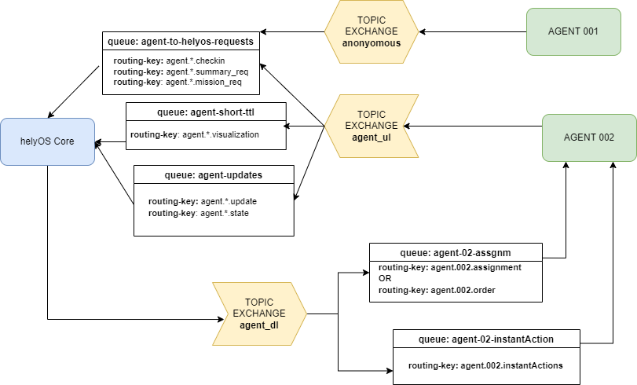

Overview
--------

.. figure:: ./img/agent_receving_mission.png
    :align: center
    :width: 600

    The process of agents receiving mission assignments

Only if the agent uuid is registered in the helyOS database can the agent and helyOS exchange messages to report on an agent’s status and perform the assignments. Usually, the status change from “non automatable” to “free” must be set manually in the agent.

| Note that before receiving any assignment, the agent must be reserved for the assignment mission. That is, the agent changes the status from "free" to "ready" (i.e., ready for the mission) upon helyOS *Reserve* request. Once the agent finishes the assignment, the agent will not set its status from "busy" to "free", but to "ready". This is because helyOS may sent him a second assignment belonging to the same mission. For this reason, the agent must wait the "Release" signal from helyOS to set itself "free".|

Exchange, Routing-keys and Queues in RabbitMQ
---------------------------------------------

    helyOS and rabbitMQ

Thanks to the RabbitMQ routing features, any RabbitMQ client subscribing to the topic exchange *agent_ul* can get the messages filtered by  routing-keys. 

The agents will address their messages to the following routing-keys: 

- **agent.{uuid}.checkin** : used only for check-in data.
- **agent.{uuid}.update** : messages related to updates of agent properties. e.g., vehicle name, geometry data.
- **agent.{uuid}.visualization** : messages reporting the positioning and sensor data. 
- **agent.{uuid}.state** : messages reporting the assignment status and agent state.
- **agent.{uuid}.mission** : messages to request missions from helyOS.
- **agent.{uuid}.factsheet** : (included for compatibility with VDA5050) messages to report geometry.

The agents will receive messages from the following routing-keys: 

- **agent.{uuid}.assignment** or **agent.{uuid}.order**: receive assignments.
- **agent.{uuid}.instantAction** : receive instant action commands from helyOS core or any other RabbitMQ client.

All messages exchanged between helyOS and the agents include the following common fields:

- **type:** string, ex: "checkin", "assignment", "cancel", etc..
- **uuid:** string,
- **body:** JSON object.

The **body** field will be specific for each message type. The easiest way to communicate to helyOS is to use the agent SDK connector methods: *publish_general_updates*, *pusblish_states* and *publish_sensors*.

Ref: 
`Documentation <https://fraunhoferivi.github.io/helyOS-agent-sdk/build/html/apidocs/helyos_agent_sdk.connector.html#module-helyos_agent_sdk.connector>`_ and `Examples <https://fraunhoferivi.github.io/helyOS-agent-sdk/build/html/examples/index.html>`_

Check in agent in helyOS
------------------------
To receive assignments from helyOS, the agent must perform a procedure called "check-in".

In the check-in procedure, the agent will 

- Connect as anonymous [*]_ to RabbitMQ and send its identification data using the routing key **agent-{uuid}-checkin**.
- Receive an individual username and password to access RabbitMQ.
- Create queues to receive the messages using the routing key to **agent-{uuid}-assignments** and **agent-{uuid}-instantActions**.

.. [*] Agents logged as anonymous are not allowed to perform any other operation than “check-in”.

.. figure:: ./img/agent_check_in.png
    :align: center
    :width: 600

    Agent check in example

Check-in data sent by the agent to helyOS.

- **Type** = "checkin".
- **Geometry:** JSON informing the physical geometry data of the vehicle.
- **Yard_uid:** Unique identifier of the yard as registered in the dashboard.

helyOS will respond with the following data:

.. figure:: ./img/agent_check_in_response.png
    :align: center
    :width: 600

    Agent check in response

Check in response sent by helyOS to the agent.

- **Type** = "check in".
- **map:** JSON with the map information from yard.
- **Rbmq_username:** rabbitMQ account to be used by this agent.
- **Rbmq_password:** rabbitMQ account to be used by this agent.
- **Password_encrypted:** If true, the rbmq_password field is encrypted with the agent public key.

Check in using python code:

.. code:: python

    def checkin_pseudo_code():
        # step 1 - connect anonymously
        temp_connection = connect_rabbitmq(rbmq_host, "anonymous", "anonymous")
        gest_channel = temp_connection.channel()

        # step 2 - create a temporary queue to receive the checkin response
        checkin_response_queue = gest_channel.queue_declare(queue="")

        # step 3 - publish the check in request
        uuid = "y4df7293-5aab-46e2-bf6b"
        publish_in_checkin_exchange_topic(yard_id=1, 
                                        uuid: uuid,
                            routing_key: f"agent-{uid}-checkin,
                                        status="free",
                                        agent_metadata=data,
                                        reply_to= checkin_response_queue)    

        # step 4 - start consume checkin_response_queue and get authentication data
        username, password = listen_checkin_response(checkin_response_queue)

        # step 5 - log to rabbitmq as agent with full permission rights.
        helyos_checked_in_connection = connect_rabbitmq(rbmq_host, username, password)

The same code using helyOS-agent-sdk python package:

.. code:: python

    from helyos_agent_sdk import HelyOSClient, AgentConnector
    helyOS_client = HelyOSClient(rbmq_host,rbmq_port,uuid="y4df7293-5aab-46e2-bf6b")
    helyOS_client.perform_checkin(yard_uid='1', agent_data=data, status="free")
    helyOS_client.get_checkin_result()

    helyos_checked_in_connection = heylOS_client.connection

helyOS-agent-sdk HelyOSClient and AgentConnector have many other attributes and methods to send and receive data from helyOS core in the correct data format. 
Check the documentation at https://fraunhoferivi.github.io/helyOS-agent-sdk/build/html/index.html.

helyOS Reserves Agent for Mission
---------------------------------
Before processing a mission request, helyOS core will reserve the required agent(s). This is done via the instant action routing key, *agent.{uiid}.InstantAction*. helyOS requests the agent to be in **"ready"** status (status="ready" and reserved=True). During the assignment, the agent's status changes to **"busy"**.  After the assignment is complete, the agent updates its status from **"busy"** to **"ready"**. At this point, helyOS may release the agent, depending on the presence of any further assignments in that mission.
The release message is also delivered via instant actions.

The agent reservation is important because 

(i) Mission calculations can require considerable computational power and take several seconds. Therefore, the agent must remain available during these period and not be used by other tasks.

(ii) Some missions require unique tools or devices that may not be present at the required agent. Thus, ensuring the readiness of both the agent and its hardware for the specific assignment is important.

(iii) In the interest of security, heavy agents, even those set to automatable mode, should communicate their upcoming assignment visually or soundly to their surroundings. This feature allows anyone nearby to abort the assignment if deemed necessary.

helyOS Sends Assignment to Agent
--------------------------------
As earlier mentioned, the assignments usually originated from the microservices. That is, the microservices translate the requested mission in assignments: :ref:`helyos_overview`. The microservices  return the assignments to helyOS core, and  helyOS  distributes them to the agents.

helyOS will send an assignment to the agent **only if the agent status is "ready"**.   This is done via the routing key *agent.{uiid}.assignments*. 

    Assignment object data format

An easy-to-implement security mechanism is to check the identity of the assignment sender. This is an embedded feature of RabbitMQ. For example, if you want your agent to only execute assignments from helyOS core, you can filter assignments originated from the RabbitMQ account "helyos_core".

Agent Requests a Mission 
------------------------

In addition to client apps, agents can also request missions from helyOS core. This feature is useful for situations such as the following:

- A smart camera identify a new obstacle and requests a mission to update helyOS map by sending the position of a new obstacle.
- A tractor requests a mission to ask assistance of another agent for executing a task.
- A truck finds itself obstructed by a fixed obstacle, it requests a mission from helyOS to remove itself from this deadlock situation.

