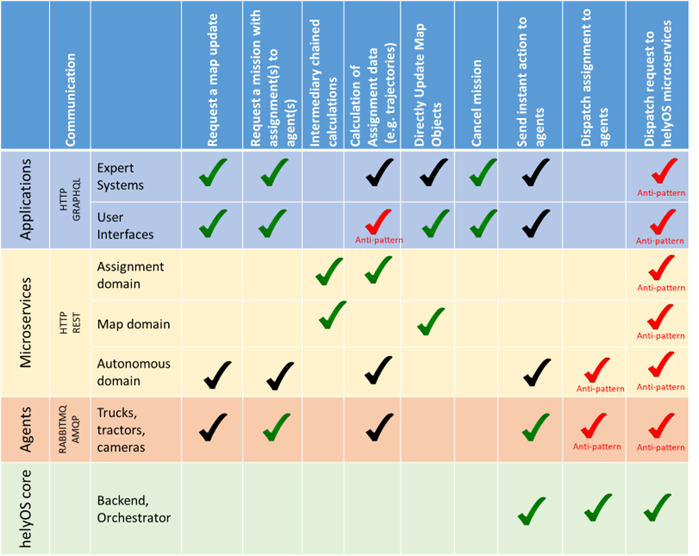
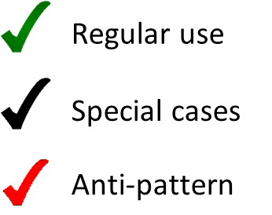
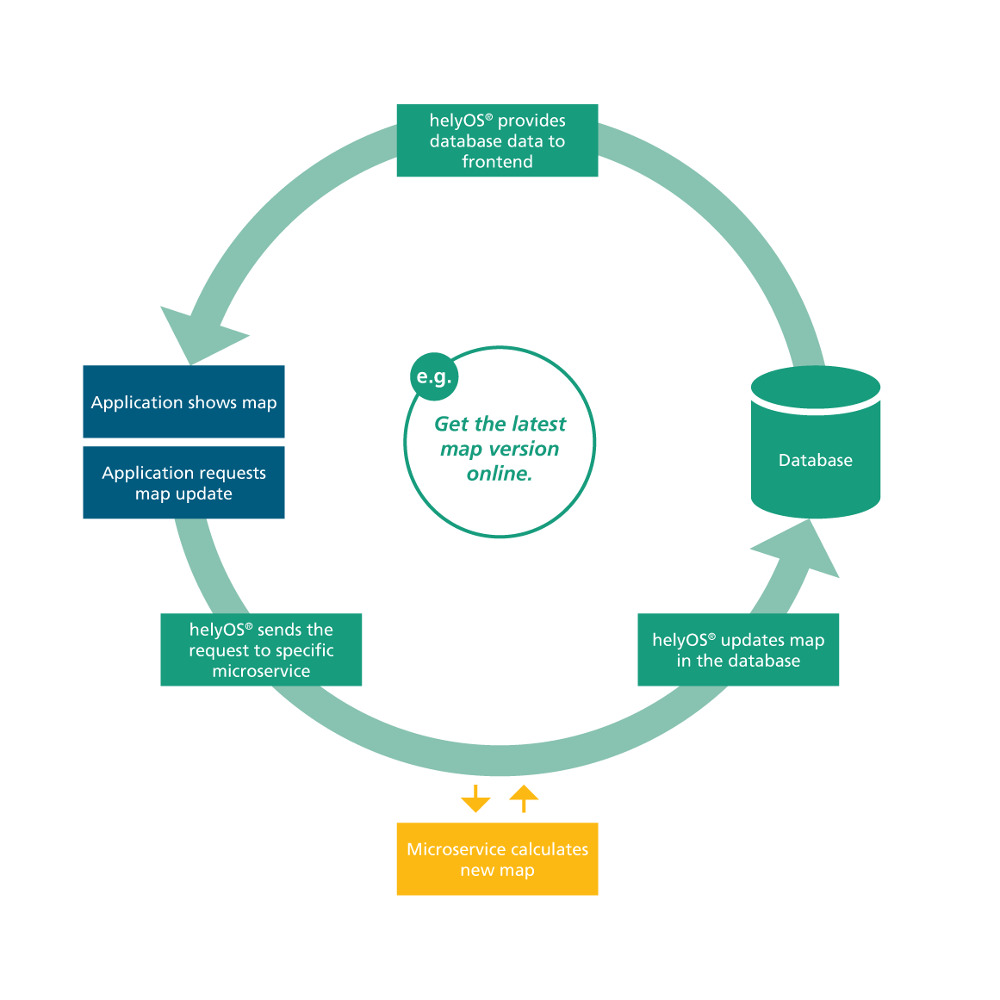
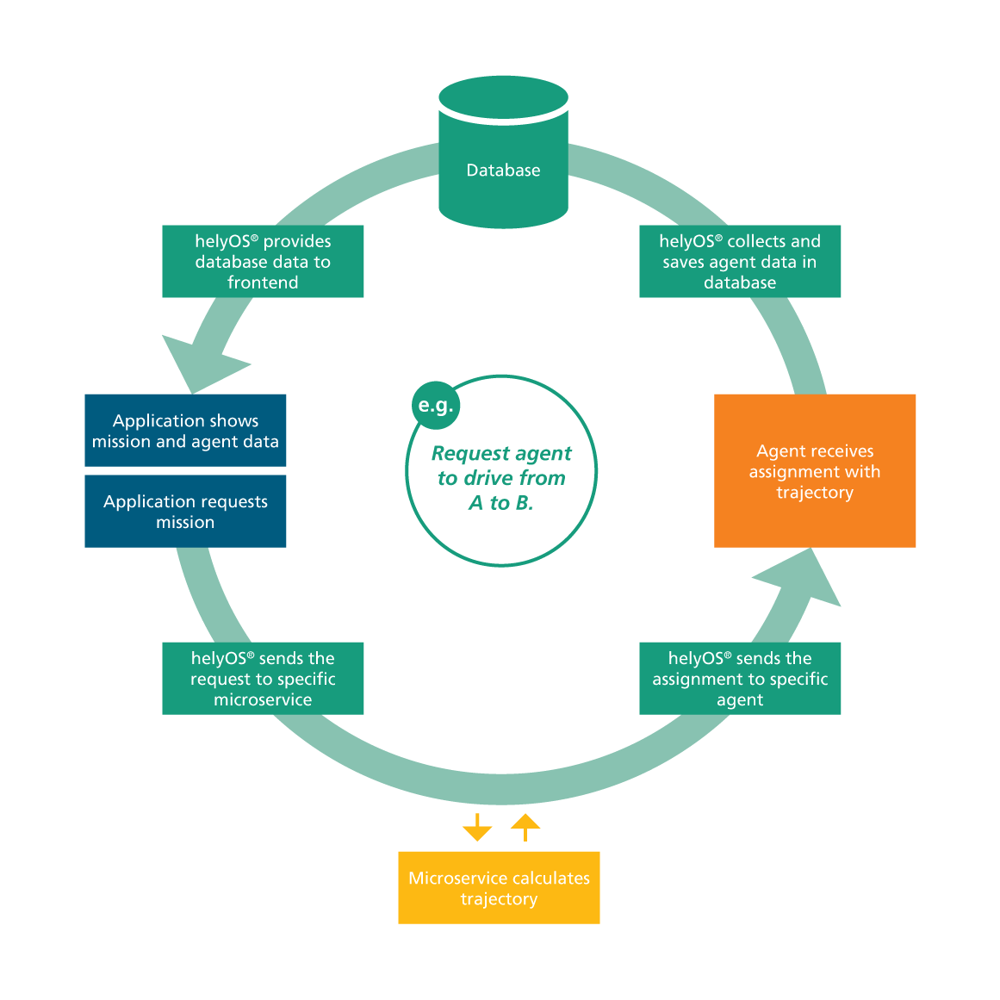
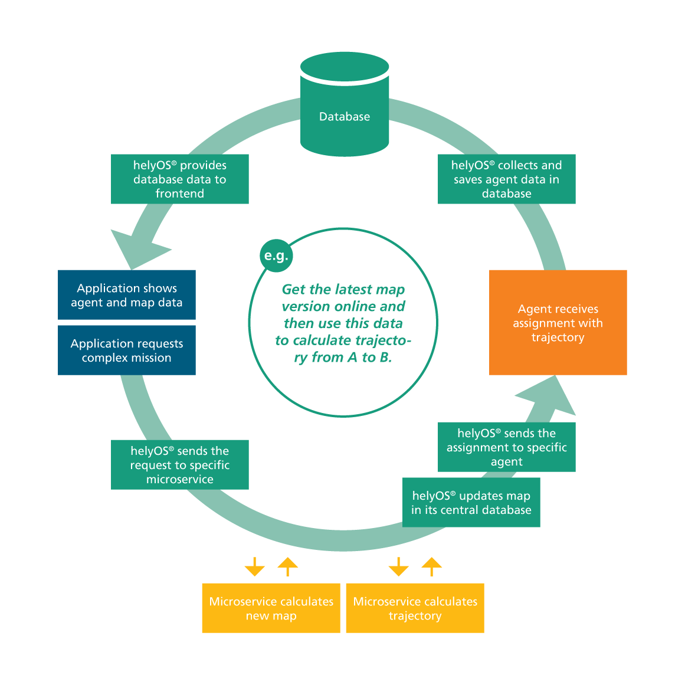
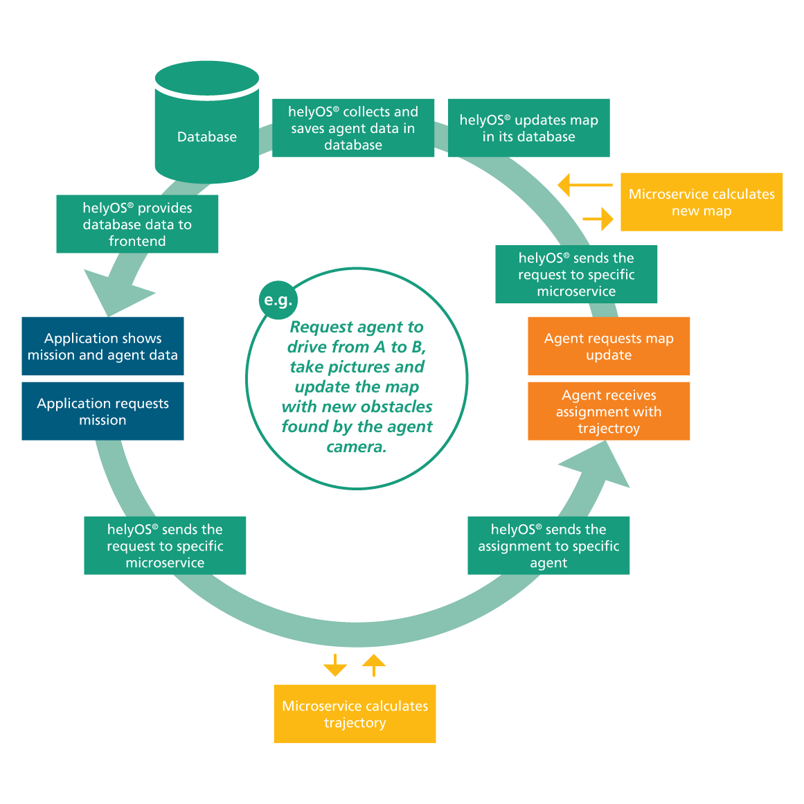

Implementation of a Yard Automation Application
===============================================

helyOS core is a single NodeJS application serving ports 5000, 5002 and 8080 for the GraphQL connection, the web socket connection and the dashboard GUI respectively. helyOS connects as a client to Postgres and RabbitMQ. All parameters for these connections are passed as environment variables.

Since helyOS is containerized, it is easy to launch a helyOS application in the cloud. Users can either run the container inside a single Linux or Windows computer of a cloud provider, or they can implement helyOS in a serverless approach using available cloud products with horizontal auto scaling.

.. figure:: ./img/yard-application-framework.png
    :align: center
    :width: 600

    helyOS yard automation application

What is possible in the helyOS framework?
-----------------------------------------

The helyOS framework gives developers many options to solve yard automation problems. To better use this flexibility, the helyOS framework suggests a template to organize the data flow and the responsibilities of each domain. Following this template will lead to a more robust and maintainable software architecture.

Examples of missions using helyOS
=================================
A. Application requests a map update.

B. Application requests truck to drive from A to B using an online path planner. 

C. Application requests truck to drive from A to B using an online path planner but employing the most recent map data in the path calculation. 

D. Application requests robot to take pictures and update the map objects.

