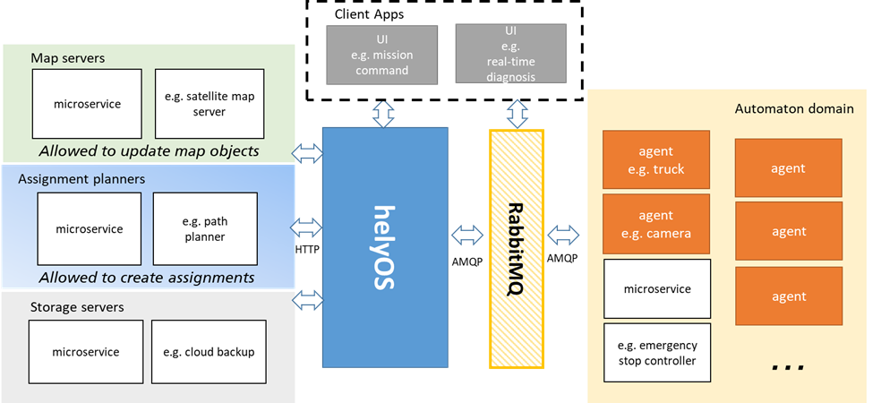

Implementation of a Yard Automation Application
===============================================

The helyOS core is a single NodeJS application serving the ports 5000, 5002, and 8080, respectively for the GraphQL, Web socket connections and dashboard GUI. 
HelyOS connects as a client to postgres and rabbitMQ. All parameters for these connections are passed as environment variables.

Since helyOS is containerized, it is easy to launch a helyOS application in the cloud. One can run the container inside a single Linux or Windows computer of a cloud 
provider, or implement helyOS in a serveless approach using available cloud products with horizontal auto scaling, or even implement your own kurbenets structure to 
have fine control of the reliability and availability of your application.

    helyOS yard automation application

What is possible in helyOS framework?
-------------------------------------

The helyOS framework gives the developer a lot of options to solve yard automation problems. To better use this flexibility, helyOS framework suggests are template to organize the data flow and the responsibilities of each domain. Following this template will lead to a more robust and maintainable software architecture.

.. figure:: ./img/helyos-framework-possibilities.png
    :align: center 
    :width: 700

.. figure:: ./img/helyos-framework-possibilities-legend.png
    :align: center 
    :width: 150

Examples of missions using helyOS
=================================
A. Application requests a map update.

B. Application requests truck to drive from A to B using an online path planner. 

.. figure:: ./img/application-example-B.png
    :align: center
    :width: 700

C. Application requests truck to drive from A to B using an online path planner but employing the most recent map data in the path calculation. 

.. figure:: ./img/application-example-C.png
    :align: center
    :width: 700

D. Application requests robot to take pictures and update the map objects.

.. figure:: ./img/application-example-D.png
    :align: center
    :width: 700