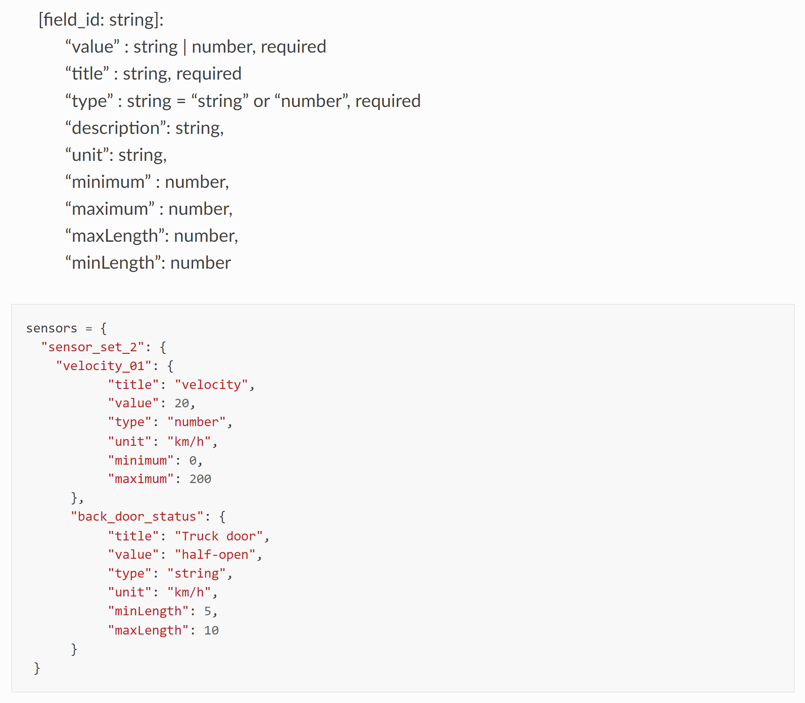

FAQ
=====

Frequently asked questions.

Why not code everything in a single backend? Why do I need helyOS?
-------------------------------------------------------------------------
Because a monolithic solution for real-world yard automation is unwise from the technical and managerial point of view.
A yard automation application integrates several technologies and are developed by interdisciplinary teams. The best way to handle
such a project is by using microservice architectures.

Please read: :ref:`helyos_overview`.

What are microservices?
-----------------------
Microservices - also known as the microservice architecture - is an architectural style that structures an application as a collection of services that are
loosely coupled, organized around business capabilities and owned by a small team. 
The microservice architecture enables an organization to deliver large, complex applications rapidly, reliably and sustainably. 

| In the helyOS framework, microservices are used to implement path planners, data parsers, map servers, storage services, etc. They are grouped and arranged according to the mission requirements.

What does it means that "helyOS orchestrates microservices"?
------------------------------------------------------------
It means that as soon helyOS receives a mission request, helyOS will:

- check the health of the services used by the mission,
- sequentially dispatch the request data to these services,
- periodically pool the server response if it is not immediately  available,
- forward the response from one service to the next one (if required),
- deliver the service response to the agents

What does it means that "helyOS orchestrates assignments"?
-----------------------------------------------------------
It means that as soon helyOS receives a mission request, helyOS will:

- check the availability of the required agents,
- send a signal to reserve the agents for the mission, 
- sequentially send the mission assignments to the agents as specified in the mission.
- release the agents if there is no more assignments to be executed in the mission or if the mission was canceled.

Can helyOS calculate trajectory paths?
--------------------------------------
No. helyOS connects to a server that calculates paths. helyOS takes care of delivering the calculated paths to the “free” agents. 
You need only to register the server URL as microservice in the helyOS dashboard.

Can I send several missions at once to one automated vehicle?
-------------------------------------------------------------
You can create **one** mission with **many** assignments to one automated vehicle.

What is the difference between mission and assignment?
-------------------------------------------------------------
A yard automation application is defined in terms of its available missions. 
To complete a mission, agents must perform one or more assignments. 
helyOS receives the request of a mission and dispatches assignments to one or more agents.

What is the data format for the agent sensors?
---------------------------------------------------
helyOS uses JSON formats. You are free to decide the data structure according to your frontend.
If you have no idea, just use the helyOS-native format and you will be safe:

    helyOS-native format for agent sensor data 

I want to use an online server for path calculation (or map information) which has its own API. How can I integrate with helyOS?
--------------------------------------------------------------------------------------------------------------------------------
You need to make a small service to convert from the original API to the helyOS API and register it as a microservice in the dashboard.
Since the helyOS API is extremely simple, this can be done with a few lines of code.

What is the difference between helyOS and Automation App?
----------------------------------------------------------

**helyOS** is a software framework used to facilitate the creation of control tower software for different applications like e.g., agriculture, logistics centers and harbors.

| **Automation App** is proprietary software application used as a frontend tool to prototype projects in logistic centers. Automation App uses helyOS as backend.

