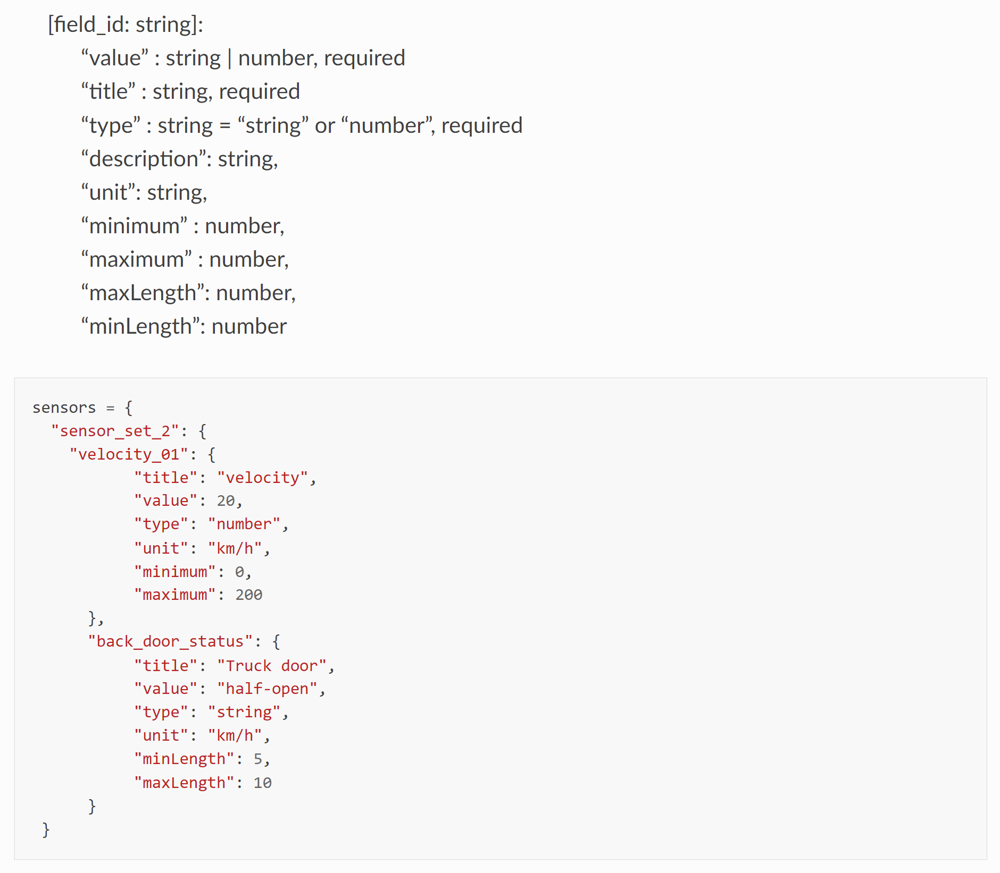

FAQ
===========

Can helyOS calculate trajectory paths?
--------------------------------------
No. helyOS connects to a server that calculates paths. helyOS takes care of delivering the calculated paths to the “free” agents. 
You need only to register the server URL as microservice in helyOS dashboard.

Can I send several missions at once to one automated vehicle?
-------------------------------------------------------------
No. But you can create **one** mission with **many** assignments to one automated vehicle.

What is the difference between mission and assignment?
-------------------------------------------------------------
A yard automation application is defined in terms of its available missions. 
To complete a mission, agents must perform one or more assignments. 
helyOS receives the request of a mission and dispatches assignments to one or more agents.

What is the data format for the agent sensors?
---------------------------------------------------
helyOS uses JSON formats. You are free to decide the data structure according to your frontend.
If you have no idea, just use the helyOS-native format and you will be safe:

    helyOS-native format for agent sensor data 

I want to use an online server for path calculation (or map information) which has its own API. How can I integrate with helyOS?
--------------------------------------------------------------------------------------------------------------------------------
You need to make a small service to convert from the original API to the helyOS API and register it as microservice in the dashboard.
Since the helyOS API is extremely simple, this can be done with a few lines of code.

What is the difference between helyOS and AutoTruck App?
--------------------------------------------------------
**helyOS** is a software framework used to facilitate the creation of control tower software for different applications like e.g., agriculture, logistics centers and harbors.

| **AutoTruck App** is proprietary software application used as a frontend tool to prototype projects in logistic centers. AutoTruck App uses helyOS as backend.

